<!-- portrait: python scripts/make_ascii_svg.py   (draws assets/portrait.txt; pass a photo instead to sample one, needs Pillow)
     card:     python scripts/make_card_svg.py    (edit INFO in the script)
     graph:    redrawn daily by .github/workflows/update-profile.yml -->

<h3><code>erik@github ~ $ whoami</code></h3>

<table>
<tr>
<td valign="top"></td>
<td valign="top"></td>
</tr>
</table>

 

<h3><code>erik@github ~ $ ./contributions.sh</code></h3>

 
 

<h3><code>erik@github ~ $ ls ~/projects</code></h3>

<table>
<tr>
<td width="50%" valign="top">

**[Nexus Grind](https://github.com/ErikKarasek/nexus-grind-releases)** 
Desktop (Tauri) and mobile (Expo) app, synced through Supabase.

</td>
<td width="50%" valign="top">

**[Job Tracker](https://github.com/ErikKarasek/job-tracker)** 
Job-hunt board with an AI agent, a morning scout and a résumé fitted to each posting.

</td>
</tr>
<tr>
<td width="50%" valign="top">

**[Spidey Portfolio](https://github.com/ErikKarasek/spidey-portfolio)** 
Spider-Man themed portfolio with GSAP animations, live at [erikkarasek.cz](https://erikkarasek.cz).

</td>
<td width="50%" valign="top">

**[Subscription Tracker](https://github.com/ErikKarasek/subscription-tracker)** 
Tracks recurring subscriptions, real monthly spend and upcoming renewals.

</td>
</tr>
</table>

 

<h3><code>erik@github ~ $ ./links.sh</code></h3>

